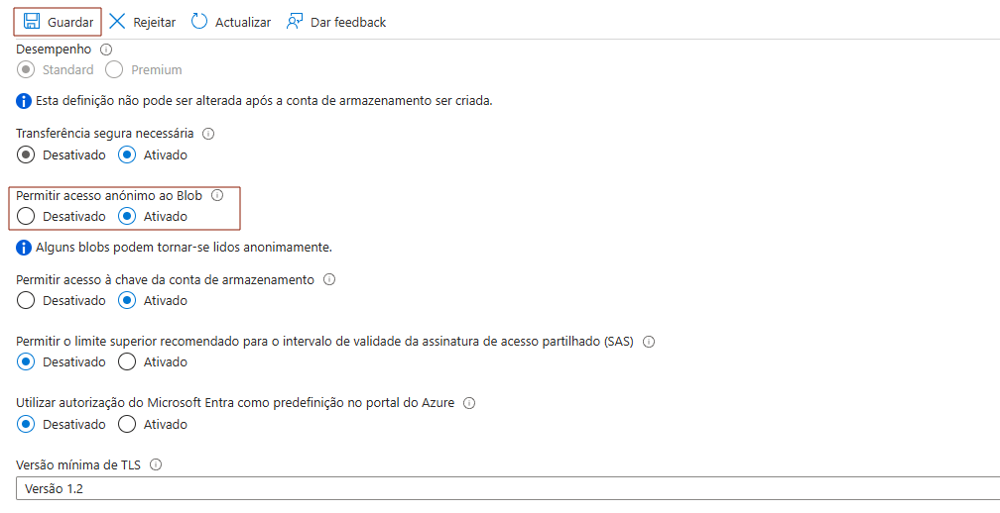
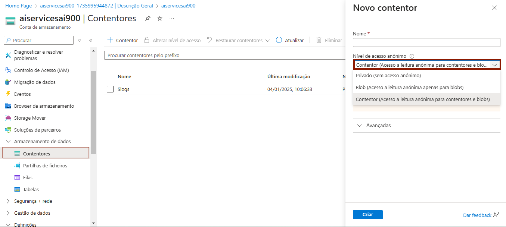
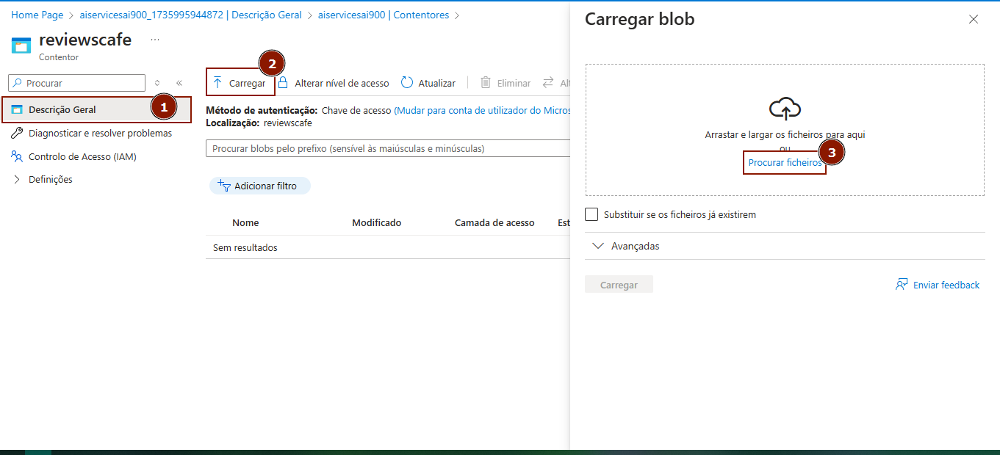
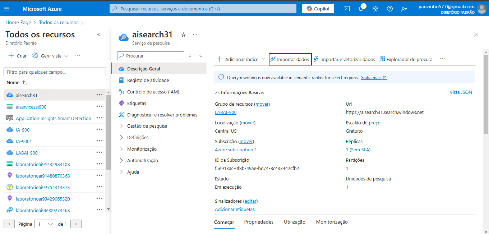
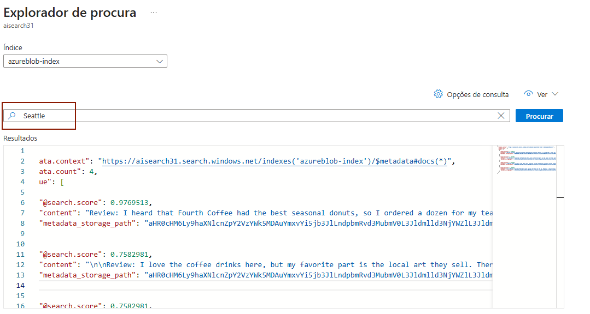

**Descrição**

O laboratório de pesquisa em indexação de conteúdo com IA no Microsoft Azure é um ambiente especializado no desenvolvimento de soluções avançadas para a organização, busca e recuperação de informações a partir de grandes volumes de dados. Utilizando a infraestrutura escalável e segura da nuvem Azure, o laboratório permite que pesquisadores e desenvolvedores explorem e implementem tecnologias de inteligência artificial, como aprendizado de máquina, processamento de linguagem natural (PLN) e análise semântica, para aprimorar a indexação e a classificação de conteúdo.

**Requisitos para a configuração do serviço**

    - Storage account
    - Recurso no AI Search
    - Recurso de IA

Configuração da Storage Account

Criação e configuração de container

Basta selecionar o container recém criado e seguir a ordem dos passos

Ir no AISearch e importar dados

Após selecionar a base de dados, ir no explorador de busca

Já no explorador de busca, basta selecionar o termo e pesquisar

**Uma aplicação interessante utilizando essa tecnologia**

A aplicação poderia ser usada por marcas para monitorar a reputação online em tempo real. Analisando os comentários em redes sociais, a IA seria capaz de classificar o sentimento geral em relação à marca e seus produtos, detectando rapidamente se há um aumento de comentários negativos ou positivos. Isso ajudaria as empresas a tomar medidas corretivas imediatas, caso identifiquem uma possível crise de reputação ou, ao contrário, aproveitar uma onda de feedback positivo.